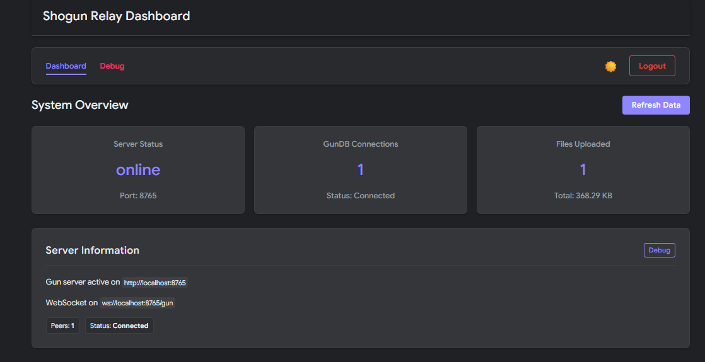

# 

[](https://www.npmjs.com/package/shogun-relay)
[](https://opensource.org/licenses/MIT)
[](https://www.typescriptlang.org/)
[](https://deepwiki.com/scobru/shogun-relay)

Shogun Relay is a production-ready **GunDB relay** with a built-in IPFS control plane. It provides a single node that can relay Gun traffic, persist data with RADISK, manage IPFS storage, and expose rich admin dashboards.



---

## Table of Contents

1. [Highlights](#highlights)
2. [Architecture at a Glance](#architecture-at-a-glance)
3. [Getting Started](#getting-started)
4. [Configuration](#configuration)
5. [Admin Authentication](#admin-authentication)
6. [Admin Interfaces](#admin-interfaces)
7. [API Overview](#api-overview)
8. [Key Tools](#key-tools)
9. [Development Notes](#development-notes)
10. [Troubleshooting](#troubleshooting)
11. [Contributing](#contributing)
12. [License](#license)

---

## Highlights

- **GunDB Relay Core**
  - WebSocket relay with RADISK persistence and WebRTC support.
  - Drop-in peer for any Gun client.

- **Integrated IPFS Control**
  - Authenticated API proxy (JWT support) and content preview.
  - Upload files, manage pins, run garbage collection.

- **Operational Dashboards**
  - Admin panel with stats, service status, charts, and a Gun visual explorer.
  - Modern IPFS Pin Manager with batch operations and inline preview.

- **Security First**
  - Single admin token reused across APIs and dashboards.
  - Rate limiting and protected static routes.

---

## Architecture at a Glance

```
┌──────────────┐      ┌──────────────┐        ┌───────────────┐
│  Gun Clients │◀────▶│ Shogun Relay │◀──────▶│   IPFS Node   │
└──────────────┘      └──────────────┘        └───────────────┘
       ▲                     ▲                           ▲
       │                     │                           │
       │             Admin Dashboards & APIs             │
       └─────────────────────────────────────────────────┘
```

- `relay/src/index.js` boots Gun, Express, and the admin routes.
- `relay/src/routes/` contains modular REST endpoints (system, IPFS, uploads, notes, debug, services).
- `relay/src/public/` hosts the admin web applications.

---

## Getting Started

### Requirements

- Node.js 18+
- IPFS node (local or remote) with API access
- `ADMIN_PASSWORD` and (optionally) `IPFS_API_TOKEN`

### Quick Start (Docker)

```bash
git clone <repository-url>
cd shogun-relay
./docker-start.sh

# verify the relay is alive
curl http://localhost:8765/health
```

### Manual Setup

```bash
cd shogun-relay/relay
npm install

# start in development mode
npm run dev
```

Admin dashboards live at `http://localhost:8765/`.

---

## Configuration

Create a `.env` file or export the variables below:

| Variable           | Description                                              | Default                |
|--------------------|----------------------------------------------------------|------------------------|
| `ADMIN_PASSWORD`   | Shared token for all admin routes and dashboards         | _(required)_           |
| `IPFS_API_URL`     | IPFS API endpoint                                        | `http://127.0.0.1:5001`|
| `IPFS_API_TOKEN`   | JWT token for IPFS API                                   | _(optional)_           |
| `IPFS_GATEWAY_URL` | Gateway used for content preview / proxy                 | `http://127.0.0.1:8080`|
| `RELAY_PORT`       | HTTP port for Shogun Relay                               | `8765`                 |
| `RELAY_HOST`       | Advertised host                                          | auto-detected          |
| `DATA_DIR`         | RADISK data directory                                    | `./data`               |
| `RELAY_PROTECTED`  | Require admin token for Gun writes                       | `true`                 |

Additional switches (Radisk toggle, cleanup, peers, etc.) are documented inside `index.js`.

---

## Admin Authentication

Every privileged action uses the same administrator token.

```http
Authorization: Bearer <ADMIN_PASSWORD>
# or
token: <ADMIN_PASSWORD>
```

The admin dashboards rely on `lib/admin-auth.js` to sync the token across tabs. Use HTTPS in production to protect the credential.

---

## Admin Interfaces

| Path                  | Description                                | Auth |
|-----------------------|--------------------------------------------|------|
| `/admin`              | Main control panel (navigation & shortcuts)| ✅   |
| `/stats`              | Live metrics & charts                      | ✅   |
| `/services-dashboard` | Service health overview                    | ✅   |
| `/pin-manager`        | IPFS pin manager with preview & batch ops  | ✅   |
| `/upload`             | Direct IPFS uploads                        | ✅   |
| `/visualGraph`        | GunDB visual explorer (public reads)       | ⚠️*  |
| `/graph`              | Alternate Gun graph viewer                 | ⚠️*  |
| `/chat`               | Demo public chat                           | ❌   |

`⚠️` The explorers browse public coordinates without a token but prompt for the admin token when write access is required.

---

## API Overview

### GunDB Core
- `GET /gun` – WebSocket endpoint for Gun clients.
- `GET /gun.js` – Client library.
- `GET|POST|DELETE /api/v1/system/node/*` – Inspect or update nodes via REST.

### IPFS Management
- `POST /api/v1/ipfs/upload` – Upload streams (admin).
- `GET /api/v1/ipfs/content/:cid` – Stream IPFS content (used by preview panel).
- `POST /api/v1/ipfs/pins/{add|rm|ls}` – Pin operations.
- `GET /api/v1/ipfs/status` – Connectivity check.
- `GET /api/v1/ipfs/repo/stat` – Repository statistics.
- `POST /api/v1/ipfs/repo/gc` – Garbage collection.
- `POST /api/v0/*` – Raw IPFS API proxy (admin).

### System & Debug
- `GET /api/v1/system/health` – Detailed health report.
- `GET /api/v1/system/alldata` – Dump `shogun` namespace (admin use).
- `GET /api/v1/system/logs` / `DELETE /api/v1/system/logs` – Log management.
- `GET /api/v1/services/status` – Service snapshot.
- `POST /api/v1/services/:service/restart` – Restart stub.
- `GET /api/v1/debug/...` – Helpers for storage usage, uploads, etc.

### Notes
- `/api/v1/notes/*` – Encrypted admin notes (token required).
- `/api/v1/notes/regular/*` – Public demo notes API.

### Visual Graph
- `/visualGraph/*` – Static assets backing the D3.js explorer.

Full endpoint definitions live in `relay/src/routes/`.

---

## Key Tools

### IPFS Pin Manager (`/pin-manager`)
- Single-CID operations plus batch unpin with throttled progress.
- System hash preservation to avoid deleting user uploads.
- Inline content preview (images, video, audio, text, JSON) with gateway and download shortcuts.

### Upload Interface (`/upload`)
- Drag & drop uploads with optional encryption.
- Tracks IPFS hashes in GunDB and the system hash registry.
- Provides quick links to local, relay, and public gateways.

### Visual Graph Explorer (`/visualGraph`)
- Depth-first navigation across Gun nodes.
- Live editing (set/delete) when authenticated.
- Peer status indicators and root navigation helpers.

---

## Development Notes

Project structure:

```
shogun-relay/
├── relay/
│   ├── src/
│   │   ├── index.js          # Express + Gun bootstrap
│   │   ├── routes/           # REST endpoints
│   │   └── public/           # Admin & utility frontends
├── docker/                   # Compose utilities and helper scripts
└── README.md
```

Recommended workflow:
1. Run `npm run dev` while editing frontends (refresh browser to reload).
2. Use the Pin Manager and Upload UI to exercise the IPFS endpoints.
3. Tail the server logs or hit `/api/v1/system/logs` for debugging.

---

## Troubleshooting

| Issue | Command / Tip |
|-------|---------------|
| Gun clients fail to connect | `wscat -c ws://localhost:8765/gun` |
| IPFS API unauthorized | Ensure `IPFS_API_TOKEN` matches the daemon JWT (`cat /tmp/ipfs-jwt-token`). |
| Admin UI shows “token required” | Visit `/admin`, enter the token once, then reload the target page. |
| Batch pin removal slow | The Pin Manager intentionally throttles requests (`100ms`) to avoid overloading IPFS. |

---

## Contributing

1. Fork the repository.
2. Create a branch for your feature or fix.
3. Add tests or sample scripts when relevant.
4. Submit a pull request describing the change and testing steps.

Community feedback is welcome via issues or discussions.

---

## License

MIT License © Shogun contributors. See [LICENSE](LICENSE) for details.
