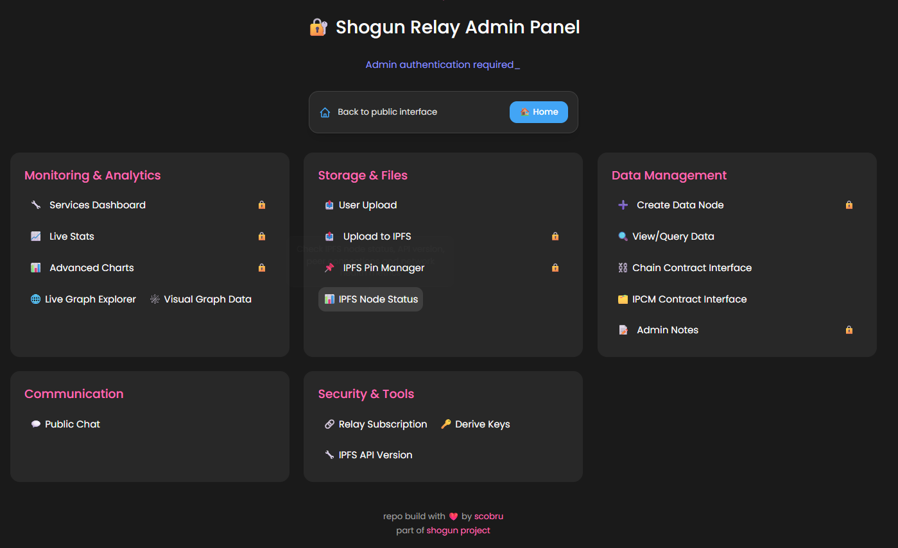

# Shogun Relay

[](https://www.npmjs.com/package/shogun-relay)
[](https://opensource.org/licenses/MIT)
[](https://www.typescriptlang.org/)
[](https://deepwiki.com/scobru/shogun-relay)

A complete **GunDB relay server** with integrated IPFS storage for admin use. Provides decentralized database functionality with IPFS file management capabilities.


_Shogun Relay Admin Panel - Complete control interface for managing your decentralized infrastructure_

## 🚀 Features

### 🔐 Admin Authentication & Security

- **Admin Authentication**: Centralized admin token management with auto-fill
- **IPFS API Protection**: JWT-based authentication for IPFS API endpoints
- **Rate Limiting**: Protection against abuse and spam

### 🌐 GunDB Relay Core

- **Decentralized Database**: Full GunDB relay with WebSocket support
- **Real-time Synchronization**: Live data sync across all connected peers
- **Graph Database**: Hierarchical data structure with soul/key/value pairs
- **WebRTC Support**: Peer-to-peer connections for enhanced decentralization
- **Local Storage**: Persistent data storage with radisk

### 📁 Admin File Management System

- **Admin File Uploads**: Direct IPFS storage with admin authentication
- **IPFS Integration**: Direct IPFS storage with pin management
- **File Encryption**: Optional file encryption before upload
- **Pin Management**: Comprehensive IPFS pin management with batch operations

### 🎯 Visual Graph Interface

- **Real-time Data Visualization**: Interactive D3.js graph exploration
- **GunDB Integration**: Direct connection to decentralized database
- **DFS Traversal**: Depth-First Search for comprehensive node exploration
- **Data Inspector**: View and edit node properties in real-time
- **Load All Nodes Mode**: Direct loading for complete graph visualization

### 🗂️ IPFS Pin Manager

- **Comprehensive Pin Management**: Add, remove, and list IPFS pins
- **Batch Operations**: Bulk unpin with progress tracking
- **System File Preservation**: Protect user uploads during bulk operations
- **Connection Testing**: IPFS API connectivity verification

### 📊 Admin Management

- **System Monitoring**: Real-time system performance monitoring
- **Service Management**: Service restart and status monitoring
- **Log Management**: System logs with filtering and cleanup
- **Peer Management**: GunDB peer configuration and monitoring

## �� API Endpoints

### 🔐 Admin Authentication

```bash
# Admin Authentication (via headers)
Authorization: Bearer YOUR_ADMIN_TOKEN
# OR
token: YOUR_ADMIN_TOKEN
```

### 🗄️ GunDB Core

```bash
# GunDB WebSocket endpoint
GET /gun                    # GunDB WebSocket connection
GET /gun.js                 # GunDB client library

# GunDB REST API
GET  /api/v1/system/node/*                    # Get GunDB node
POST /api/v1/system/node/*                    # Create/update GunDB node
DELETE /api/v1/system/node/*                  # Delete GunDB node
```

### 📁 IPFS Management (Integrated)

```bash
# Pin Management
POST /api/v1/ipfs/pins/add          # Add pin
POST /api/v1/ipfs/pins/rm           # Remove pin
POST /api/v1/ipfs/pins/ls           # List all pins
GET  /api/v1/ipfs/version           # IPFS version info
GET  /api/v1/ipfs/status            # IPFS status
GET  /api/v1/ipfs/repo/stat         # IPFS repository stats
POST /api/v1/ipfs/repo/gc           # Run garbage collection

# File Upload & Content
POST /api/v1/ipfs/upload            # Upload file to IPFS
GET  /api/v1/ipfs/content/:cid      # Get IPFS content
GET  /api/v1/ipfs/content-json/:cid # Get IPFS content as JSON

# IPFS API Proxy (Admin only)
POST /api/v0/*                      # Direct IPFS API proxy (admin)
POST /api/v1/ipfs/api/*             # IPFS API proxy via relay (admin)
GET  /api/v1/ipfs/test              # Test IPFS connection

# IPFS Gateway
GET  /ipfs/*                         # IPFS gateway access
GET  /ipns/*                         # IPNS gateway access
```

### 📁 Admin File Management

```bash
# Admin File Operations
POST /api/v1/ipfs/upload                      # Upload file to IPFS (admin)
GET  /api/v1/ipfs/content/:cid                # Get IPFS content
GET  /api/v1/ipfs/content-json/:cid           # Get IPFS content as JSON

# System File Management (Admin Only)
GET  /api/v1/user-uploads/system-hashes       # Get all system file hashes (for pin manager)
GET  /api/v1/user-uploads/system-hashes-map   # Get system hashes with details (for pin manager)
POST /api/v1/user-uploads/save-system-hash    # Save hash to system hashes (admin)
DELETE /api/v1/user-uploads/remove-system-hash/:hash  # Remove hash from system hashes (admin)

# Note: These endpoints manage system file hashes for pin manager protection, not user files
```

### 🛠️ System & Debug

```bash
# Health & Status
GET  /api/v1/system/health                    # Health check
GET  /api/v1/system/relay-info                # Relay information

# System Data & Stats
GET  /api/v1/system/alldata                   # All system data
GET  /api/v1/system/stats                     # System stats
POST /api/v1/system/stats/update              # Update stats
GET  /api/v1/system/stats.json                # Stats JSON

# System Operations
GET  /api/v1/system/logs                      # Get logs
DELETE /api/v1/system/logs                    # Clear logs
GET  /api/v1/system/peers                     # Get peers
POST /api/v1/system/peers/add                 # Add peer

# Services Management
POST /api/v1/services/:service/restart        # Restart service
GET  /api/v1/services/status                  # Service status

# Legacy Health Endpoints
GET  /health                                   # Basic health check
```

### 📝 Notes Management

```bash
# Admin Notes (Encrypted)
GET  /api/v1/notes/                           # Get admin notes
POST /api/v1/notes/                           # Create admin note
DELETE /api/v1/notes/                         # Delete admin note

# Regular Notes
GET  /api/v1/notes/regular                    # Get regular notes
POST /api/v1/notes/regular                    # Create regular note
DELETE /api/v1/notes/regular                  # Delete regular note
PUT  /api/v1/notes/regular/:id                # Update regular note
GET  /api/v1/notes/regular/:id                # Get regular note
```

### 🎯 Visual Graph

```bash
# Visual Graph Interface
GET  /visualGraph/                            # Visual graph interface
GET  /visualGraph/visualGraph.js              # Visual graph JS
GET  /visualGraph/abstraction.js              # Abstraction JS
GET  /visualGraph/vGmain.css                  # Visual graph CSS
GET  /visualGraph/visualGraphIcon.svg         # Visual graph icon
```

### 🔧 Debug Endpoints

```bash
# Debug endpoints for troubleshooting
GET  /api/v1/debug/*                          # Various debug endpoints
```

### 📱 Admin Web Interfaces

```bash
# Main Admin Interfaces (Admin Authentication Required)
GET  /admin                                   # Admin panel
GET  /stats                                   # Stats interface (admin)
GET  /services-dashboard                      # Services dashboard (admin)
GET  /pin-manager                             # Pin manager interface (admin)
GET  /upload                                  # Upload interface (admin)
GET  /charts                                  # Charts interface (admin)

# Public Interfaces (No Authentication Required)
GET  /graph                                   # Graph interface
GET  /chat                                    # Chat interface

# Static Assets
GET  /lib/:filename                           # JavaScript library files
GET  /styles/:filename                        # CSS style files
```

## 🔐 Admin Authentication

The Shogun Relay uses centralized admin token authentication for all protected operations.

### Admin Token Authentication

Required for all admin operations and IPFS API access.

```bash
# Header format
Authorization: Bearer YOUR_ADMIN_TOKEN
# OR
token: YOUR_ADMIN_TOKEN

# Example
curl -H "Authorization: Bearer admin123" \
     http://localhost:8765/api/v1/system/health
```

### Authentication Requirements by Endpoint Type

| Endpoint Type       | Authentication Required | Method                              |
| ------------------- | ----------------------- | ----------------------------------- |
| Admin Operations    | Admin Token             | Bearer Token                        |
| IPFS API            | Admin Token             | Bearer Token                        |
| System Operations   | Admin Token             | Bearer Token                        |
| Public Endpoints    | None                    | None                                |

### Environment Variables

```bash
# Admin authentication
ADMIN_PASSWORD=your-secure-admin-token

# IPFS API protection
IPFS_API_TOKEN=your-ipfs-api-token
```

## 📱 Admin Web Interfaces

The Shogun Relay includes a comprehensive set of admin web interfaces for managing the decentralized infrastructure.

### 🎛️ Admin Panel (`/admin`)

The main admin panel provides centralized management of all relay functions:

#### 📊 Monitoring & Analytics

- **Services Dashboard**: Real-time monitoring of all relay services
- **Live Stats**: Performance metrics and system status
- **Advanced Charts**: Data visualization and usage analytics
- **Live Graph Explorer**: Interactive GunDB data exploration
- **Visual Graph Data**: D3.js powered network visualization

#### 📁 Storage & Files

- **Upload to IPFS**: Direct IPFS file upload interface (admin)
- **IPFS Pin Manager**: Comprehensive pin management with batch operations (admin)
- **IPFS Node Status**: Real-time IPFS node monitoring

#### 💬 Communication

- **Public Chat**: Community communication interface

#### 🔐 Security & Tools

- **IPFS API Version**: API version management and monitoring

**Note:** The Data Management section is currently empty as all blockchain-related data management features have been removed.

### 🎯 Visual Graph Interface (`/visualGraph`)

Interactive GunDB data visualization with real-time exploration capabilities:

#### Features

- **Interactive D3.js Visualization**: Force-directed graph layout with zoom and pan
- **Real-time Data Loading**: Direct GunDB connection with authentication
- **DFS Traversal**: Comprehensive node exploration with configurable limits
- **Load All Nodes Mode**: Direct loading for complete graph visualization
- **Data Inspector**: View and edit node properties in real-time
- **Authentication Integration**: Seamless admin token integration

#### Configuration

- **Relay Peer URL**: GunDB endpoint (default: your relay URL)
- **Auth Token**: Admin authentication (auto-loaded)
- **Start Key**: GunDB key to begin traversal
- **Label Property**: Property to use as node labels

### 📤 Admin Upload Interface (`/upload`)

Admin file storage interface:

#### Features

- **Admin Authentication**: Centralized admin token required
- **File Upload**: Drag & drop or file selection
- **Direct IPFS Upload**: Bypass user system
- **File Management**: View, download, and delete files
- **Encryption Support**: Optional file encryption

### 🗂️ IPFS Pin Manager (`/pin-manager`)

Advanced pin management with automatic system file protection:

#### Features

- **Individual Pin Operations**: Add, remove, and manage individual pins
- **Batch Unpin All**: Bulk operation with progress tracking
- **System File Protection**: Automatically preserves user uploads
- **Modern Design**: Clean, responsive interface
- **Real-time Progress**: Detailed progress tracking with logs

### 📊 Additional Admin Interfaces

#### **Admin-Only Interfaces (Authentication Required):**
- **Stats Interface** (`/stats`): Performance metrics and analytics
- **Services Dashboard** (`/services-dashboard`): Service monitoring
- **Charts Interface** (`/charts`): Data visualization
- **Pin Manager** (`/pin-manager`): IPFS pin management
- **Upload Interface** (`/upload`): Direct IPFS file upload

#### **Public Interfaces (No Authentication Required):**
- **Chat Interface** (`/chat`): Community communication
- **Graph Interface** (`/graph`): Data visualization

## 🎯 Visual Graph

The relay includes a powerful visual graph interface for exploring GunDB data structures in real-time.

### Features

- **Interactive D3.js Visualization**: Force-directed graph layout with zoom and pan
- **Real-time Data Loading**: Direct GunDB connection with authentication
- **DFS Traversal**: Comprehensive node exploration with configurable limits
- **Load All Nodes Mode**: Direct loading for complete graph visualization
- **Data Inspector**: View and edit node properties in real-time
- **Authentication Integration**: Seamless admin token integration

### Access

```bash
# Direct access
https://your-relay.ngrok.io/visualGraph

# From main interface
https://your-relay.ngrok.io → Click "Visual Graph"
```

### Configuration

- **Relay Peer URL**: GunDB endpoint (default: your relay URL)
- **Auth Token**: Admin authentication (auto-loaded)
- **Start Key**: GunDB key to begin traversal
- **Label Property**: Property to use as node labels


## 🗂️ IPFS Pin Manager

Advanced pin management with automatic system file protection and modern UI.

### Features

- **Individual Pin Operations**: Add, remove, and manage individual pins with clean interface
- **Batch Unpin All**: Bulk operation with progress tracking and system file preservation
- **System File Protection**: Automatically preserves user uploads during bulk operations
- **Modern Design**: Clean, responsive interface with consistent color scheme
- **Real-time Progress**: Detailed progress tracking with comprehensive logs
- **Smart Filtering**: Intelligent system file detection and preservation

### System File Protection

When "🛡️ Preserve system files" is enabled:

- **Automatic Detection**: System hashes are automatically managed when files are uploaded/removed
- **Smart Preservation**: Only non-system files are unpinned during bulk operations
- **Detailed Statistics**: Shows total pins, preserved files, and files to remove
- **Real-time Updates**: System hashes are updated automatically during file operations
- **Admin Authentication**: Supports admin token authentication

### Automatic System Hash Management

- **Upload Integration**: Files are automatically added to system hashes when uploaded
- **Removal Integration**: Hashes are automatically removed when files are deleted/unpinned
- **Batch Operations**: System hashes are properly managed during bulk operations
- **Error Resilience**: Upload operations continue even if system hash management fails

### Usage

1. **Individual Pins**: Enter CID and use Add/Remove buttons
2. **Batch Operations**: Use "Unpin All Files" with preservation toggle
3. **System Files**: Checkbox protects user uploads by default
4. **Progress Tracking**: Real-time progress with detailed logs

### API Integration

```bash
# Get system hashes for pin manager (admin)
GET /api/v1/user-uploads/system-hashes

# Get detailed system hashes map (admin)
GET /api/v1/user-uploads/system-hashes-map

# Save hash to system hashes (admin)
POST /api/v1/user-uploads/save-system-hash

# Remove hash from system hashes (admin)
DELETE /api/v1/user-uploads/remove-system-hash/:hash
```

**Note:** These endpoints use the legacy `/user-uploads/` path but now only manage system file hashes for pin manager protection, not user files.

## 📁 Admin File Upload System

### Admin Upload Interface (`/upload`)

- **Admin Authentication**: Centralized admin token
- **Direct IPFS Upload**: Direct file upload to IPFS
- **Encryption Options**: Encrypt files with admin token
- **Multiple Gateways**: Local, relay, and public gateway URLs

### Storage Features

- **GunDB Metadata**: File information stored in decentralized database
- **System Hash Management**: Automatic system file hash tracking
- **Pin Management**: Integrated IPFS pin management
- **File Encryption**: Optional file encryption before upload

## 🔐 Admin Authentication System

### Admin Authentication

- **Centralized Token Management**: Single admin token for all operations
- **Auto-fill Support**: Automatic token loading from Control Panel
- **Cross-interface Sync**: Token shared across all admin interfaces
- **Secure Storage**: Token stored securely in browser

### IPFS API Protection

- **JWT Authentication**: Automatic JWT token generation by IPFS
- **Environment Fallback**: `IPFS_API_TOKEN` environment variable
- **Container Security**: Tokens only accessible inside container

## 🚀 Installation & Setup

### Quick Start with Docker

```bash
# Clone and start
git clone <repository-url>
cd shogun-relay
./docker-start.sh

# Verify installation
curl http://localhost:8765/health
```

### Environment Configuration

```bash
# Copy and configure environment
cp .env.example .env

# Key variables
IPFS_API_TOKEN=your-secret-token    # IPFS API protection
ADMIN_PASSWORD=your-admin-token     # Admin authentication
```

### Manual Setup

```bash
# Install dependencies
cd relay
npm install

# Start development server
npm run dev
```

## 📊 Monitoring & Debugging

### Health Checks

```bash
# Basic health
curl http://localhost:8765/health

# Detailed health
curl http://localhost:8765/api/v1/health

# System info
curl http://localhost:8765/api/v1/system/relay-info
```

### Logs

```bash
# Container logs
docker logs -f shogun-relay-stack

# Real-time monitoring
docker exec shogun-relay-stack tail -f /var/log/supervisor/relay.log
```

### Debug Endpoints

```bash
# System hashes (for pin manager)
GET /api/v1/user-uploads/system-hashes

# System hashes map with details
GET /api/v1/user-uploads/system-hashes-map

# Health check
GET /api/v1/system/health
```

## 🌐 Ports & Services

- **8765**: Main GunDB relay server (HTTP/WebSocket)
- **5001**: IPFS API (authenticated, integrated)
- **8080**: IPFS Gateway (integrated)
- **4001**: IPFS Swarm (P2P, integrated)

### Main Admin Interfaces

#### **Admin-Only Interfaces (Authentication Required):**
- `/admin`: Admin panel
- `/stats`: Performance metrics
- `/services-dashboard`: Service monitoring
- `/charts`: Data visualization
- `/pin-manager`: IPFS pin management
- `/upload`: Admin file upload interface

#### **Public Interfaces (No Authentication Required):**
- `/`: Control Panel with navigation
- `/gun`: **GunDB WebSocket endpoint** (Primary)
- `/visualGraph`: Interactive GunDB visualization
- `/chat`: Community communication
- `/graph`: Data visualization

## 🔧 Development

### Admin Panel Interface

The Shogun Relay includes a comprehensive admin panel that provides centralized management of all relay functions:

#### 📊 Monitoring & Analytics

- **Services Dashboard**: Real-time monitoring of all relay services
- **Live Stats**: Performance metrics and system status
- **Advanced Charts**: Data visualization and usage analytics
- **Live Graph Explorer**: Interactive GunDB data exploration
- **Visual Graph Data**: D3.js powered network visualization

#### 📁 Storage & Files

- **Upload to IPFS**: Direct IPFS file upload interface (admin)
- **IPFS Pin Manager**: Comprehensive pin management with batch operations (admin)
- **IPFS Node Status**: Real-time IPFS node monitoring

#### 💬 Communication

- **Public Chat**: Community communication interface

#### 🔐 Security & Tools

- **Derive Keys**: Cryptographic key derivation tools
- **IPFS API Version**: API version management and monitoring


The admin panel requires authentication and provides a unified interface for managing your entire decentralized infrastructure from a single location.

### Project Structure

```
shogun-relay/
├── relay/
│   ├── src/
│   │   ├── routes/           # API routes
│   │   │   ├── ipfs.js       # IPFS management (integrated)
│   │   │   ├── uploads.js    # Admin file management
│   │   │   ├── system.js     # System operations
│   │   │   └── visualGraph.js # Visual graph routes
│   │   ├── public/           # Frontend interfaces
│   │   │   ├── pin-manager.html
│   │   │   ├── upload.html
│   │   │   ├── visualGraph/
│   │   │   └── styles/
│   │   └── index.js          # Main GunDB server
├── docker/                   # Docker configuration
├── docker-compose.yml
└── README.md
```

### Key Components

- **GunDB Core**: Decentralized database relay with WebSocket support
- **IPFS Integration**: HTTP proxy to IPFS API with authentication
- **Admin File Upload**: Multer-based file handling with encryption
- **Visual Graph**: D3.js visualization with DFS traversal
- **Pin Manager**: Comprehensive IPFS pin management

## 🛠️ Troubleshooting

### Common Issues

**GunDB Connection Problems**

```bash
# Test GunDB connection
curl http://localhost:8765/gun

# Check WebSocket endpoint
wscat -c ws://localhost:8765/gun

# Test GunDB client library
curl http://localhost:8765/gun.js
```

**IPFS Connection Problems (Integrated)**

```bash
# Check IPFS status
curl -H "Authorization: Bearer $IPFS_API_TOKEN" http://localhost:5001/api/v0/version

# Verify JWT token
docker exec shogun-relay-stack cat /tmp/ipfs-jwt-token
```

**File Upload Problems**

```bash
# Check system hashes
curl http://localhost:8765/api/v1/user-uploads/system-hashes

# Check IPFS status
curl -H "Authorization: Bearer $IPFS_API_TOKEN" http://localhost:5001/api/v0/version
```

### Performance Optimization

- **GunDB Timeouts**: Increased timeouts for large datasets
- **Batch Operations**: Efficient bulk operations with progress tracking
- **Caching**: Browser-based caching for static assets

## 📊 Complete Feature Overview

### 🔐 Admin Authentication & Security

- **Admin Token Authentication**: Centralized admin token for all operations
- **Secure Token Management**: Centralized admin token with auto-fill support
- **IPFS API Protection**: JWT-based authentication for IPFS endpoints

### 🗄️ GunDB Core Features

- **Decentralized Database**: Full GunDB relay with WebSocket support
- **Real-time Synchronization**: Live data sync across all connected peers
- **Graph Database**: Hierarchical data structure with soul/key/value pairs
- **WebRTC Support**: Peer-to-peer connections for enhanced decentralization
- **Local Storage**: Persistent data storage with radisk

### 📁 Admin File Management System

- **Admin File Uploads**: Direct IPFS storage with admin authentication
- **IPFS Integration**: Direct IPFS storage with pin management
- **File Encryption**: Optional file encryption before upload
- **System File Protection**: Automatic system file hash management
- **Pin Management**: Comprehensive IPFS pin management

### 🎯 Visual & Management Interfaces

- **Admin Panel**: Comprehensive centralized management interface
- **Visual Graph**: Interactive D3.js GunDB data exploration
- **Pin Manager**: Advanced IPFS pin management with batch operations
- **Admin Upload Interface**: Direct IPFS file storage for admin use
- **Monitoring Dashboards**: Real-time system monitoring and analytics

### 🛠️ System & Debug

- **Health Monitoring**: Comprehensive health checks and status monitoring
- **Performance Analytics**: Real-time stats and performance metrics
- **Log Management**: System logs with filtering and cleanup
- **Peer Management**: GunDB peer configuration and monitoring
- **Service Management**: Service restart and status monitoring
- **Debug Tools**: Extensive debugging and troubleshooting endpoints

### 💬 Communication

- **Chat Interface**: Community communication platform

### 🔄 API Coverage

- **Total Endpoints**: 40+ API endpoints
- **Authentication Methods**: Admin token authentication
- **Web Interfaces**: 10+ admin management interfaces
- **GunDB Integration**: Complete decentralized database functionality
- **IPFS Integration**: Full IPFS storage and pin management

## 🌟 Next Steps

1. **Connect Your App**: Use `https://your-relay.ngrok.io/gun` as Gun.js peer
2. **Upload Files**: Test admin upload system at `/upload`
3. **Manage Pins**: Use `/pin-manager` for IPFS pin management
4. **Explore Data**: Visit `/visualGraph` for interactive GunDB exploration
5. **Monitor System**: Check system stats and performance
6. **Debug Issues**: Use debug endpoints for troubleshooting
7. **Admin Panel**: Access `/admin` for comprehensive management
8. **Visual Graph**: Explore GunDB data with `/visualGraph`

## 📚 Additional Documentation

- **[Quick Start Guide](QUICK-START.md)**: Get started quickly
- **[Visual Graph Guide](relay/VISUAL_GRAPH.md)**: Visual graph usage
- **[Pin Manager Guide](relay/PIN_MANAGER.md)**: IPFS pin management

## 🤝 Contributing

1. Fork the repository
2. Create a feature branch
3. Implement your changes
4. Add tests if applicable
5. Submit a pull request

## 📄 License

MIT License - see LICENSE file for details

## 🧹 Docker Cleanup Script

```bash
# Pulizia sicura (raccomandata)
./docker-cleanup.sh --cache-only

# Pulizia completa (usa con cautela)
./docker-cleanup.sh --all

# Modalità dry-run (vedi cosa verrebbe pulito)
./docker-cleanup.sh --dry-run

# Aiuto
./docker-cleanup.sh --help
```

### Available Options:

- `--cache-only`: Pulizia sicura (container fermati, immagini non utilizzate, cache build)
- `--all`: Pulizia completa (include volumi - può cancellare dati)
- `--containers`: Solo container fermati
- `--images`: Solo immagini non utilizzate
- `--networks`: Solo reti non utilizzate
- `--volumes`: Solo volumi non utilizzati (ATTENZIONE: può cancellare dati)
- `--build-cache`: Solo cache di build
- `--dry-run`: Mostra cosa verrebbe pulito senza farlo

### Esempi:

```bash
# Pulizia rapida e sicura
./docker-cleanup.sh

# Verifica cosa verrebbe pulito
./docker-cleanup.sh --dry-run

# Pulizia completa con conferma
./docker-cleanup.sh --all
```

## 🚀 Quick Start
